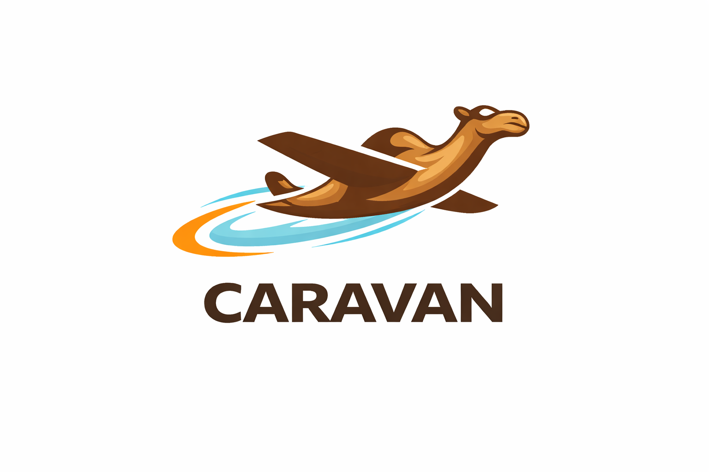

<p align="center">
  
</p>

# Caravan Flow

Visual dataflow engine for domain experts. NiFi-style canvas, Camel-style
composition, AOT-compiled edge runtime. Built on [Caravan](https://github.com/CaravanScale/caravan)
and compiled via [caravan-csharp](https://github.com/CaravanScale/caravan/tree/master/caravan-csharp)
to a 28 MB .NET 10 native binary that drops on a Raspberry Pi and also
scales out as a stateless worker pod in k8s.

## What's in the box

- **Visual programming for non-programmers.** Drag processors from a
  palette onto a canvas; wire them with drag-to-connect edges;
  configure each with typed form inputs (enums, booleans, key/value
  repeaters — not raw expression strings). Sources are first-class
  nodes with explicit outbound connections, not a hidden ingress.
- **One binary, two deployment shapes.** Standalone edge mode serves
  the UI + API from a single process. Headless mode (`--mode=headless`)
  serves API only, for k8s worker pods behind an operator + aggregator
  per `docs/design-k8s-operator.md`.
- **Rock-solid core.** Graceful SIGTERM drain, source auto-restart with
  exponential backoff, PutHTTP retries on transient failures, hot
  reload with ghost-routing detection, bearer-token auth on `/api/*`,
  Content-Length caps on ingress. `/readyz` distinct from `/health`
  for k8s probes.
- **Auto-save + git separation.** Runtime flow edits auto-save to disk
  continuously; git commit + push stays an explicit dev action so
  edge workers don't need network to persist local changes.
- **Per-user layout.** Node positions survive reloads via localStorage;
  a sibling `layout.yaml` gives teammates a shared default view
  without polluting the flow config.

## Quick start

```bash
cd caravan-flow-csharp
caravan-csharp build        # native AOT binary in build/
./build/CaravanFlow         # starts on :9091, serves UI + API

# Browse http://localhost:9091

# API probes
curl http://localhost:9091/health
curl http://localhost:9091/readyz
curl http://localhost:9091/api/registry   # processor + source catalog

# Inject a synthetic FlowFile at the graph's entry points
curl -X POST http://localhost:9091/api/flowfiles/ingest \
  -H 'Content-Type: application/json' \
  -d '{"content":"hello","attributes":{"env":"dev"}}'

# Kubernetes worker pod (no UI served, API only)
./build/CaravanFlow --mode=headless
```

## Processor catalog

| Category    | Processors |
|-------------|-----------|
| Attribute   | UpdateAttribute · LogAttribute · FilterAttribute |
| Routing     | RouteOnAttribute · RouteRecord |
| Transform   | EvaluateExpression · TransformRecord · UpdateRecord |
| Record      | SplitRecord · ExtractRecordField · QueryRecord |
| Text        | ReplaceText · ExtractText · SplitText |
| Conversion  | ConvertJSONToRecord · ConvertRecordToJSON · ConvertCSVToRecord · ConvertRecordToCSV · ConvertAvroToRecord · ConvertRecordToAvro · ConvertOCFToRecord · ConvertRecordToOCF |
| Utility     | CompressContent · DecompressContent |
| Sink        | PutFile · PutHTTP · PutStdout |
| V3 framing  | PackageFlowFileV3 · UnpackageFlowFileV3 |
| Source      | GetFile · GenerateFlowFile · ListenHTTP |

Every parameter carries a typed descriptor (`ParamKind`) so the UI
renders enums as dropdowns, booleans as checkboxes, expression fields
with monospace textareas, and key/value pairs as row repeaters. Details:
`docs/design-ui-wizards.md` covers the next wave — domain-expert
wizards that remove the need to write expression strings at all.

## Project structure

```
caravan-flow/
├── caravan-flow-csharp/       — C# .NET 10 AOT runtime (golden track)
├── caravan-flow-java/         — Java JVM runtime (enterprise extensibility)
├── caravan-flow-ui-web/       — React graph canvas + palette (shared UI)
├── caravan-flow-ui-java/      — legacy Java UI (pre-React)
├── caravan-flow-shared/       — cross-track shared definitions
├── docs/                      — design documents + architecture
├── logo.png                   — Caravan brand
└── README.md
```

## Design documents

- [docs/architecture.md](docs/architecture.md) — runtime architecture (execution model, types, pipeline graph, providers).
- [docs/design-k8s-operator.md](docs/design-k8s-operator.md) — k8s operator + aggregator + `Flow` CRD for fleet mode.
- [docs/design-ui-wizards.md](docs/design-ui-wizards.md) — three-wave plan for record sampling + expression builder + per-processor wizards.
- [docs/data-engine-comparison.md](docs/data-engine-comparison.md) — comparison with NiFi, DeltaFi, Flink, Spark, Beam.
- [docs/nifi-component-analysis.md](docs/nifi-component-analysis.md) — NiFi processor catalog reference.

## Status

Core runtime is production-grade on both tracks. Visual programming
surface (palette + drag-drop + typed forms) is usable end-to-end. The
k8s operator + aggregator, domain-expert UI wizards, and additional
integrations (MQTT, Kafka, SQL, S3) are scoped but gated on concrete
requirements — see the roadmap docs above.

## Related

- [Caravan](https://github.com/CaravanScale/caravan) — the language Caravan Flow is written in.
- [caravan-csharp](https://github.com/CaravanScale/caravan/tree/master/caravan-csharp) — C# build backend.

## License

Apache License 2.0.
